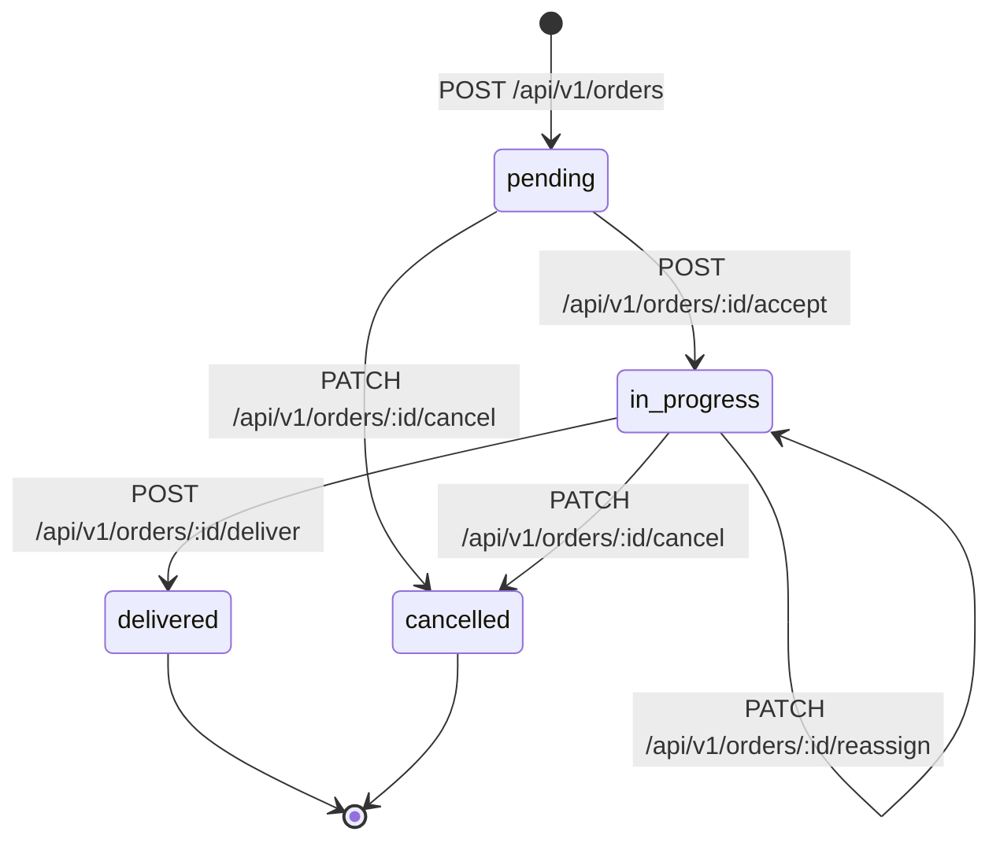

[Home](../../index.md) › [API v1](../index.md) › Orders

# 📦 Order Management Endpoints

Complete delivery order lifecycle: create, assign, deliver, cancel.

---

## Endpoints

| Method | Path | Description | Auth | WebSocket Event |
|--------|------|-------------|------|-----------------|
| 🟢 `GET` | [/api/v1/orders](./GET-list-orders.md) | List orders (RBAC filtered) | All roles | - |
| 🟢 `GET` | [/api/v1/orders/pending](./GET-pending-orders.md) | Pending orders only | All roles | - |
| 🟡 `POST` | [/api/v1/orders](./POST-create-order.md) | Create delivery order | Client, Central | `new_order` |
| 🟡 `POST` | [/api/v1/orders/:id/accept](./POST-accept-order.md) | Motoboy accepts order | Motoboy, Central | `order_accepted` |
| 🟡 `POST` | [/api/v1/orders/:id/deliver](./POST-deliver-order.md) | Mark as delivered | Motoboy, Central | `order_delivered` |
| 🔵 `PATCH` | [/api/v1/orders/:id/cancel](./PATCH-cancel-order.md) | Cancel order | Central only | `order_cancelled` |
| 🔵 `PATCH` | [/api/v1/orders/:id/reassign](./PATCH-reassign-order.md) | Reassign to different motoboy | Central only | `order_reassigned` |

---

## Order Lifecycle



### Status Transitions

| From | To | Endpoint | Role |
|------|----|----|------|
| - | `pending` | POST /api/v1/orders | Client, Central |
| `pending` | `in_progress` | POST /api/v1/orders/:id/accept | Motoboy, Central |
| `in_progress` | `delivered` | POST /api/v1/orders/:id/deliver | Motoboy, Central |
| `pending` or `in_progress` | `cancelled` | PATCH /api/v1/orders/:id/cancel | Central |
| `in_progress` | `in_progress` | PATCH /api/v1/orders/:id/reassign | Central |

---

## Business Rules

### Commission Calculation (TABELA_REPASSE)

Order value is validated against client's subscription plan. Server automatically calculates `taxaMotoboy`.

#### Client WITH Subscription (COM_MENSALIDADE)

| Order Value | Motoboy Commission | Guriri Margin |
|-------------|-------------------|---------------|
| R$ 15.00 | R$ 9.00 | R$ 6.00 |
| R$ 20.00 | R$ 12.00 | R$ 8.00 |
| R$ 30.00 | R$ 18.00 | R$ 12.00 |

#### Client WITHOUT Subscription (SEM_MENSALIDADE)

| Order Value | Motoboy Commission | Guriri Margin |
|-------------|-------------------|---------------|
| R$ 20.00 | R$ 12.00 | R$ 8.00 |
| R$ 25.00 | R$ 14.00 | R$ 11.00 |
| R$ 30.00 | R$ 16.00 | R$ 14.00 |
| R$ 35.00 | R$ 18.00 | R$ 17.00 |

**Note:** Client CANNOT override commission value. Server validates and calculates.

### Auto-Fill Pickup Address

When `coletaOverride=false` (default), server auto-fills pickup address from client profile:

```typescript
{
  coletaRua: client.street,
  coletaNumero: client.number,
  coletaBairro: client.neighborhood,
  coletaCep: client.zipCode,
  coletaComplemento: client.complement
}
```

### Payment Methods

Valid values for `formaPagamento`:
- `dinheiro` - Cash on delivery
- `pix` - Brazilian instant payment
- `credito` - Credit card
- `debito` - Debit card

---

## RBAC Filtering

Different roles see different orders in GET endpoints:

| Role | Orders Visible |
|------|---------------|
| **Client** | Only their own orders |
| **Motoboy** | Orders assigned to them + all pending orders |
| **Central** | All orders (full visibility) |

**Implementation:**

```sql
-- Client
SELECT * FROM orders WHERE clientId = :userId

-- Motoboy
SELECT * FROM orders 
WHERE motoboyId = :userId OR status = 'pending'

-- Central
SELECT * FROM orders
```

---

## WebSocket Integration

All order state changes broadcast real-time events:

### `new_order`

```json
{
  "type": "new_order",
  "payload": {
    "id": "order-uuid",
    "clientName": "Pizzaria Bella",
    "valor": "15.00",
    "status": "pending"
  }
}
```

**Recipients:** All connected users (motoboys can see new work available)

### `order_accepted`

```json
{
  "type": "order_accepted",
  "payload": {
    "id": "order-uuid",
    "status": "in_progress",
    "motoboyName": "João Silva"
  }
}
```

**Recipients:** All connected users (client knows who accepted)

### `order_delivered`

```json
{
  "type": "order_delivered",
  "payload": {
    "id": "order-uuid",
    "status": "delivered",
    "deliveredAt": "2024-11-24T11:00:00Z"
  }
}
```

**Recipients:** All connected users (client confirmation, motoboy earnings updated)

---

## Testing

### Complete Flow (Postman)

1. **Login as Client:**
   - Run: `Authentication > POST Login`
   - Save token automatically

2. **Create Order:**
   - Run: `Orders > POST Create Order`
   - Save `ORDER_ID` variable

3. **Login as Motoboy:**
   - Run: `Authentication > POST Login` (motoboy credentials)

4. **Accept Order:**
   - Run: `Orders > POST Accept Order`
   - Uses `{{ORDER_ID}}` from step 2

5. **Deliver Order:**
   - Run: `Orders > POST Deliver Order`

### cURL Example

```bash
# 1. Create order
ORDER_ID=$(curl -X POST http://localhost:5000/api/v1/orders \
  -H "Authorization: Bearer $CLIENT_TOKEN" \
  -H "Content-Type: application/json" \
  -d '{
    "entregaRua": "Av. Atlântica",
    "entregaNumero": "1500",
    "entregaBairro": "Praia",
    "entregaCep": "29216000",
    "valor": "15.00",
    "formaPagamento": "pix"
  }' | jq -r '.id')

# 2. Accept order (as motoboy)
curl -X POST http://localhost:5000/api/v1/orders/$ORDER_ID/accept \
  -H "Authorization: Bearer $MOTOBOY_TOKEN"

# 3. Deliver order
curl -X POST http://localhost:5000/api/v1/orders/$ORDER_ID/deliver \
  -H "Authorization: Bearer $MOTOBOY_TOKEN"
```

---

## Related Documentation

- [Order Model Schema](../models/Order.md)
- [WebSocket Events](../../websocket/events.md)
- [Order Lifecycle Guide](../../../guides/order-lifecycle.md)
- [Commission Structure](../../../architecture/commission-structure.md)
- [AI Assignment Engine](../../../architecture/ai-engine.md)
